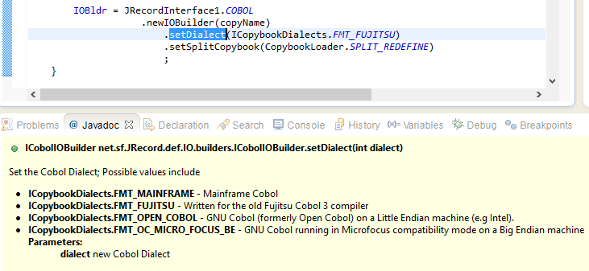

# <a id="newusers">Notes for New Users</a>

The first thing new users need to decide is

*   Are you going to use the _Java_ interface ???, then see [Java Interface](#javaInterface)
*   Are you going to use the existing [Cobol2Csv](lib/Overview.html#Csv2Cbl) / [Cobol2Xml](lib/CobolData2Xml/Cobol2Xml_ReadMe.htm) interfaces. These programs will convert Cobol-Data-Files to/from Csv/Xml files.
*   Are you going to write _your own generic_ interface ???. If so look at the **CobolSchemaReader** class and see how it is used in Cobol2Xml. Also If copying files, look at **Copy** class.

## <a id="javaInterface">Getting started with JRecord Java interface</a>

The starting point for the most common JRecord operations is the **<font color="blue">JRecordInterface1</font> class**. For Cobol operataions you start with **<font color="blue">JRecordInterface1</font>.<font color="green">COBOL</font>**.

A program to read a _Cobol-Data_ file using a cobol Copybook looks like:

```java
   2     ICobolIOBuilder ioBldr 
   3                 = JRecordInterface1.COBOL
   4                     .newIOBuilder("CobolCopybook.cbl")
   5                         .setSplitCopybook(CopybookLoader.SPLIT_01_LEVEL)
   6                         .setDialect(ICopybookDialects.FMT_FUJITSU);
   7     AbstractLineReader reader = ioBldr.newReader("input File Name");
   8     AbstractLine l;
   9         
  10     while ((l = reader.read()) != null) {
  11         ...
  12     }
  13     reader.close();
```

See the [JRecord Manual](Docs/JRecordIntro.htm#HDRIOBLDR) for a description of IOBuilders. There are examples in the [Source\JRecord_IO_Builder_Examples](Source\JRecord_IO_Builder_Examples) project.

If you have the **JavaDoc** setup correctly in your IDE, there are descriptions / list of options available for the various methods:



### <a id="CodeGen">Code Generation</a>

To help you get started with JRecord, there are 2 Code Generators available:

*   In the Cobol-Import section of the [RecordEditor](https://sourceforge.net/projects/record-editor/) you can specify a Cobol Copybook and a Sample data file. The RecordEditor should be able to figure out the correct file options and it can create a IOBuilder + Field-Name class for the Cobol-Copybook/File. This should be useful for new user trying to figure out which options to use. There is more on this in the. See [RecordEditor in JRecord Guide](Docs/JRecordIntro.htm#HDRCBLIMPORT) for details
*   The [JRecord CodeGen](Docs/JRecordIntro.htm#HDRCODEGEN) sub-project will generate a skelton Java~JRecord Read/write programs from a Cobol Copybook.

### JRecord CodeGen Utility

The [CodeGen](https://sourceforge.net/projects/jrecord/files/jrecord_CodeGen/) utility will generate sample read/write programs for a Cobol Copybook. The **CodeGen** utility can be downloaded from

[https://sourceforge.net/projects/jrecord/files/jrecord_CodeGen/](https://sourceforge.net/projects/jrecord/files/jrecord_CodeGen/)

The following **CodeGen** examples all refer to this **Cobol Copybook**:

```
 9               03  DTAR020-KCODE-STORE-KEY.
10                   05 DTAR020-KEYCODE-NO      PIC X(08).
11                   05 DTAR020-STORE-NO        PIC S9(03)   COMP-3.
12               03  DTAR020-DATE               PIC S9(07)   COMP-3.
13               03  DTAR020-DEPT-NO            PIC S9(03)   COMP-3.
14               03  DTAR020-QTY-SOLD           PIC S9(9)    COMP-3.
15               03  DTAR020-SALE-PRICE         PIC S9(9)V99 COMP-3.
```

To call **CodeGen** in a bat file:
```
  java -jar ../../lib/JRecordCodeGen.jar  ^
               -Template           standard ^
               -package            example.ioBuilder.dtar020 ^
               -Schema             DTAR020.cbl   ^
                 -FileOrganisation FixedWidth ^
                 -font cp037 ^
                 -DropCopybookName   true ^
               -outputDirectory    DTAR020
```


This will generate a <font color="blue">Cobol-Field-name</font> class, skelton <font color="blue">Read</font> class and a skelton <font color="blue">write</font> class. The generated **FieldName** class is
```java
32 public class FieldNamesDtar020 {
33 
34     public static final RecordDtar020 RECORD_DTAR020 = new RecordDtar020();
35 
36     public static class RecordDtar020 {
37        public final String keycodeNo = "KEYCODE-NO";
38        public final String storeNo = "STORE-NO";
39        public final String date = "DATE";
40        public final String deptNo = "DEPT-NO";
41        public final String qtySold = "QTY-SOLD";
42        public final String salePrice = "SALE-PRICE";
43     }
44 }
```

The generated code to **read** the file is
```java
60         AbstractLine line;
61         int lineNum = 0;
62 
63         try {
64             ICobolIOBuilder iob = JRecordInterface1.COBOL
65                                        .newIOBuilder(copybookName)
66                                            .setFont("CP037")
67                                            .setFileOrganization(Constants.IO_FIXED_LENGTH)
68                                            .setSplitCopybook(CopybookLoader.SPLIT_NONE)
69                                            .setDropCopybookNameFromFields(true)
70                                        ;
71 
72 
73             FieldNamesDtar020.RecordDtar020 rDtar020 = FieldNamesDtar020.RECORD_DTAR020;
74             AbstractLineReader reader = iob.newReader(salesFile);
75             while ((line = reader.read()) != null) {
76                 lineNum += 1;
77                 System.out.println(
78                               line.getFieldValue(rDtar020.keycodeNo).asString()
79                       + " " + line.getFieldValue(rDtar020.storeNo).asString()
80                       + " " + line.getFieldValue(rDtar020.date).asString()
81                       + " " + line.getFieldValue(rDtar020.deptNo).asString()
82                       + " " + line.getFieldValue(rDtar020.qtySold).asString()
83                       + " " + line.getFieldValue(rDtar020.salePrice).asString()
84                    );
85             }
86 
87             reader.close();
88         } catch (Exception e) {
```
